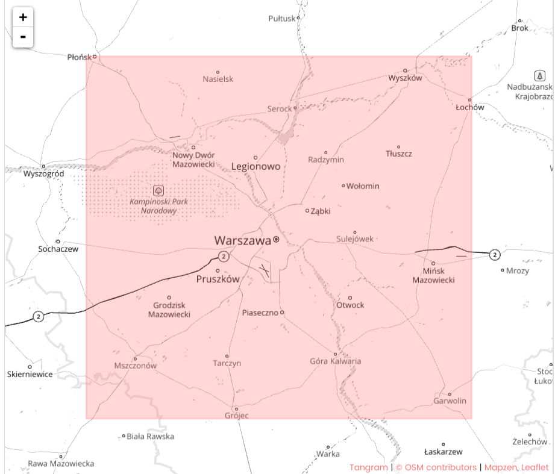

# OpenStreetMap Data Wrangling and Querying with SQL

 

[OpenStreetMap](https://www.openstreetmap.org) is a free, editable map of the whole world that is being built by volunteers largely from scratch and released with an open-content license.  
The [OpenStreetMap License](https://www.openstreetmap.org/copyright) allows free (or almost free) access to the map images and all of the underlying map data. The project aims to promote new and interesting uses of this data.

The application:

- Selects a map of Warsaw from OpenStreetMap and applies data munging techniques to audit the data for validity, accuracy, completeness, consistency, and uniformity.  
- Rectifies identified issues and exports the audited data from XML to CSV format.  
- Stores the CSV files in an SQLite database using a selected schema.  
- Utilizes SQL queries to aggregate the stored data.  

## Requirements

 - Python 2.7
 - sqlite
 - Pandas

## Usage

* [report_viz.html](https://jkarakas.github.io/Wrangle-OpenStreetMaps-Data-with-SQL/report_viz.html) - The report documenting the audit process and SQL-query & aggregation findings.

* [data.py](data.py) - Audit (using [audit.py](audit.py)) the `warsaw-poland.OSM` map   and write it in the following CSV files(with the corresponding[headers]:

		   warsaw_poland_nodes.csv.......... ['id', 'lat', 'lon', 'user', 'uid', 'version', 'changeset', 'timestamp']
		   warsaw_poland_nodes_tags.csv..... ['id', 'key', 'value', 'type']
		   warsaw_poland_ways.csv........... ['id', 'user', 'uid', 'version', 'changeset', 'timestamp']
		   warsaw_poland_ways_nodes.csv..... ['id', 'key', 'value', 'type']
		   warsaw_poland_ways_tags.csv...... ['id', 'node_id', 'position']

 * [store.py](store.py) - Create a SQL Database `warsaw_poland.db` and store the CSV's according to the provided [schema](schema.py).

